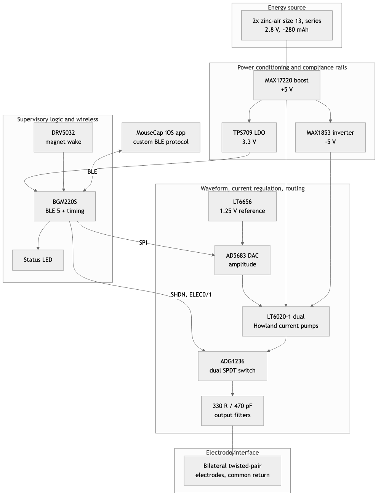
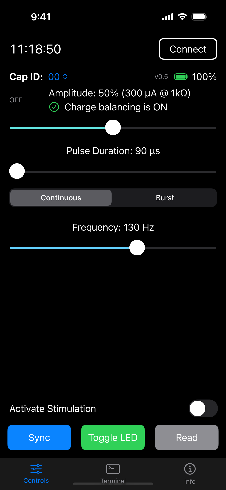
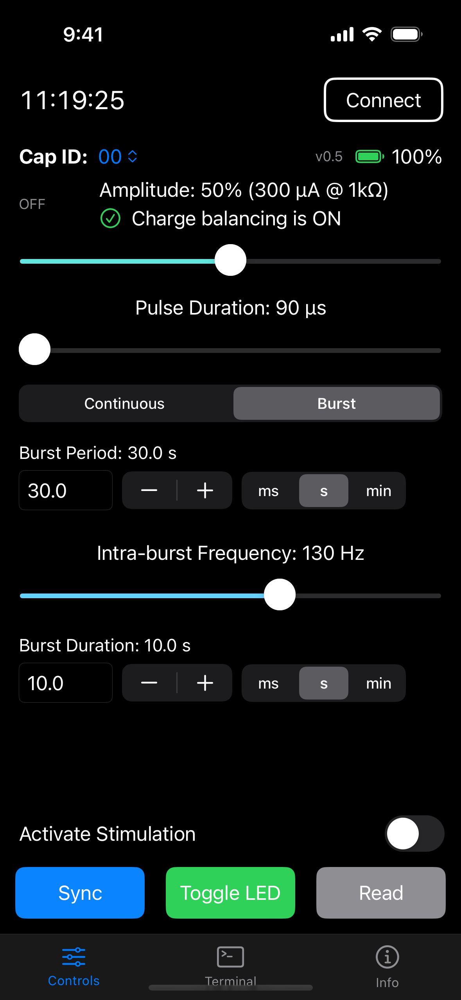

**Authors:** [PLACEHOLDER: author list and order] · Meaghan C. Creed [PLACEHOLDER: co-authors]

**Affiliations:** [PLACEHOLDER: Department(s)], Washington University School of Medicine in St. Louis, St. Louis, MO, USA. [PLACEHOLDER: Neurotech Hub / engineering affiliation]

**Corresponding author:** [PLACEHOLDER: name, email]

**Running title:** Wireless bilateral DBS for acute rodent experiments

> **Note to co-authors (delete before submission).** Sections 1, 2, 4.4, 5 and 7 are drafted from the v8.1 schematic and netlist, the v0.5 firmware, the MouseCap iOS app and its BLE protocol specification, and bench current measurements. Sections 3, 4.1–4.3 and 6 are placeholders that state what has to be measured. Everything derived from the schematic rather than measured is marked as such. One circuit observation that needs a bench answer before anything is asserted about it is flagged in §4.1 (Howland network balance). The device is named "Creed v8.1" throughout as a working label; rename globally once a name is chosen.

## Abstract

[PLACEHOLDER: ~250 words. Structure: (1) rodent DBS is usually tethered; (2) existing wireless systems optimize for chronic runtime at the cost of flexibility; (3) we present a configurable, constant-current, bilateral wireless stimulator with a smartphone interface for acute experiments; (4) electrode impedance and stimulator compliance are characterized as a coupled problem; (5) bench validation of current accuracy, pulse fidelity and load tolerance; (6) in-vivo functional validation against tethered stimulation; (7) the platform supports acute experiments of about [N] hours to [N] days per battery set. Fill numbers from §4.]

**Keywords:** deep brain stimulation; wireless; constant current; rodent; bilateral; Bluetooth Low Energy; electrode impedance; open hardware

## 1. Introduction

Deep brain stimulation (DBS) in rodents is an experimental instrument as much as a therapeutic model. Stimulation parameters that produce a behavioral effect in one paradigm can be inert or opposite in another, and the field's most informative preclinical studies have depended on being able to vary frequency, amplitude and target within an experiment rather than fixing them in hardware. Low-frequency stimulation of the nucleus accumbens paired with pharmacology, for example, reversed cocaine-evoked synaptic plasticity where conventional high-frequency stimulation did not [1], and the therapeutic and side-effect profiles of subthalamic stimulation depend on parameters that are still being optimized preclinically [2]. The broader translational argument for circuit-informed stimulation paradigms assumes an electrical stimulator flexible enough to implement them [3].

Most rodent DBS experiments still rely on tethered stimulators. A tether constrains movement, complicates behavioral assays that depend on unconstrained locomotion or social interaction, and adds commutator and handling overhead. Wireless rodent stimulators exist, but the published mouse-scale systems have largely been designed for chronic implantation, where runtime of weeks is the objective. They achieve that runtime by fixing waveform and parameters in hardware, limiting configurability to a magnet or near-field programmer, running from a battery-direct rail with a few volts of compliance, and giving up bilateral or independent-channel operation (see §5). Those are the right trade-offs for a chronic implant. They are not the right trade-offs for an acute experiment.

Acute experiments occupy a different engineering space. The experimenter needs to set and change parameters at the cage, deliver true constant current into electrodes whose impedance is not known in advance and drifts after implantation, stimulate bilaterally, and do so for hours to a few days rather than months. In that setting, generous compliance voltage, a precision current source, a real radio link and a phone-based user interface matter more than quiescent current.

Here we describe such a platform, Creed v8.1: a battery-powered, constant-current, bilateral DBS device with ±5 V compliance rails, programmable amplitude, pulse width and frequency, continuous and burst stimulation modes, and a Bluetooth Low Energy (BLE) interface to an iOS application. We present the design as one point in a generalized DBS architecture (§2), characterize the electrode load it must drive (§3), validate it electrically (§4), position it against tethered and published wireless systems (§5), and demonstrate functional equivalence to tethered stimulation in a behavioral assay (§6). The device is positioned as an acute research instrument, not a power-optimized chronic implant; the distinction organizes the design and is revisited in the discussion (§7).

## 2. System architecture and implementation

### 2.1 General DBS architecture

Figure 1 presents the stimulator as a set of functional blocks rather than a schematic. Every implanted or head-mounted constant-current stimulator contains the same eight elements, and the design space is defined by how each is implemented:

1. **Energy source.** Primary or rechargeable cells; the cell chemistry sets the rail voltage and the usable capacity.
2. **Power conditioning and compliance-voltage generation.** Either the battery drives the output stage directly (compliance limited to the cell voltage, typically ~3 V) or a converter generates higher and/or negative rails.
3. **Stimulation timing and waveform generation.** A microcontroller timer, a dedicated hardware sequencer, or an analog oscillator; the choice sets timing resolution and the processor duty cycle.
4. **Current regulation.** A programmable current source (Howland pump, current-mirror DAC, or a resistor-defined source), or a constant-voltage output with no regulation.
5. **Polarity and output routing.** Switches or an H-bridge that direct the regulated current to one or more electrodes and, for biphasic stimulation, reverse it.
6. **Charge recovery.** Active reversal of current (symmetric or asymmetric), passive electrode shorting, or none.
7. **Supervisory logic.** The microcontroller that stores parameters, sequences the pulse, and monitors the battery.
8. **Wireless control and telemetry.** A radio for real-time control, a near-field or magnetic interface for occasional reprogramming, or none.

The same block diagram exposes the principal trade-offs: battery-direct versus boosted rails, constant-current versus constant-voltage stimulation, single versus split supplies, active versus passive charge recovery, real-time wireless control versus autonomous operation, and acute flexibility versus chronic power optimization. Every published rodent stimulator in §5 can be placed on this diagram by naming its choice for each block.

### 2.2 Creed v8.1 implementation

Creed v8.1 implements the general architecture with the choices listed in Table 1. Component-level detail sufficient to reproduce the device (schematic, netlist, bill of materials, firmware, app and protocol specification) is provided as supplementary material; the main text describes function.

**Table 1.** Creed v8.1 implementation of each architectural block.

| Block | Creed v8.1 implementation |
|---|---|
| Energy source | Two size-13 (PR48) zinc-air cells in series: 2.8 V nominal, ~280 mAh |
| Power conditioning | MAX17220 boost converter to +5 V; MAX1853 charge-pump inverter to −5 V; TPS709 LDO from +5 V to 3.3 V for logic |
| Timing and waveform | BGM220S microcontroller; pulse edges from a 32.768 kHz low-frequency timer; amplitude from a 16-bit DAC |
| Current regulation | Two improved Howland current pumps (LT6020-1 dual precision op amp) on ±5 V, one per hemisphere, sharing one DAC command |
| Polarity and routing | ADG1236 dual SPDT analog switch: each pump output either to its electrode or to ground; polarity reversal by stepping the DAC across the 1.25 V reference |
| Charge recovery | Active, asymmetric: reverse-polarity phase at one-fifth amplitude for five times the pulse width |
| Supervisory logic | Same BGM220S; parameters held in non-volatile memory; battery voltage measured by the on-chip ADC |
| Wireless | BLE 5 with a custom text protocol; iOS application (MouseCap) for configuration; Hall-effect sensor for magnet wake |

**Power tree.** The two zinc-air cells feed the boost converter, which generates the +5 V rail. The negative rail is derived from +5 V by a charge-pump inverter that is enabled whenever +5 V is present. Logic runs from a 3.3 V linear regulator fed by +5 V. The output stage therefore has a 10 V supply span, and every subsystem, including the microcontroller and radio, sits downstream of the boost converter. This is the defining choice of an acute design: compliance and precision are bought with converter overhead that a chronic implant would not accept (§7).

**Current source.** A 1.25 V precision reference (LT6656) serves as the analog mid-rail and as the external reference of a 16-bit DAC (AD5683, external-reference variant, gain 2), so the DAC output spans 0–2.5 V centered on 1.25 V. The DAC output drives both Howland pumps through matched 10 kΩ input and feedback resistors, with a 2 kΩ sense resistor in each output leg. At the reference voltage the commanded current is zero; stepping the DAC below the reference produces one polarity and stepping above it produces the other. With the ideal network values the transconductance is 6.25 µA per percent of full scale (625 µA at 100 %); the application labels amplitude as a percentage and as the nominal current into a 1 kΩ load, ~6 µA per percent, i.e. 300 µA at 50 % and 600 µA at 100 %. The accuracy of that calibration and its dependence on load is the subject of §4.1.

**Channels.** The device has two output channels, one per hemisphere, each with its own Howland pump, switch and output filter (330 Ω series resistance and 470 pF to ground on each line). The two channels share the DAC command, so they deliver the same amplitude and, in the current firmware, the same timing: both switches close and open together and both pumps see the same DAC steps. Independent timing per channel is possible with the existing hardware because each switch has its own control line; independent amplitude is not, because the DAC is shared. All experiments described here use both channels together. The electrode connector carries the two channel outputs and a common ground return.

**Pulse generation.** Each pulse is sequenced by the microcontroller as a fixed chain (Figure 1, inset): the op amp is brought out of shutdown and allowed 150 µs to settle with the DAC at the zero-current reference; the switches then connect both pumps to their electrodes and are allowed 30 µs; the DAC steps to the commanded amplitude for the programmed pulse width *P*; the DAC steps to the opposite polarity at one-fifth amplitude for 5·*P*; the DAC returns to the reference; the switches disconnect the electrodes; and the op amp is shut down. Switches change state only at zero commanded current, so the load is never connected to a saturated open-circuit current source and never disconnected mid-pulse. Pulse edges are produced by DAC steps into an already-connected load. The reversed phase carries the same charge as the stimulating phase, so each pulse is charge-balanced by construction. Because the op amp is enabled per pulse, its on-time is roughly 210 µs + 6·*P*, about 10 % of the period at a 90 µs pulse and 130 Hz, rising to about 50 % at 600 µs.

Pulse and inter-pulse timing derive from the 32.768 kHz low-frequency timer (30.5 µs tick). Interrupt latency, tick quantization and the DAC write add a constant ~117 µs per segment, which the firmware subtracts from each programmed duration; the residual error is quantified in §4.1. Stimulation frequency is set by a periodic timer at the programmed rate. In burst mode a second periodic timer starts a train of pulses at the intra-burst frequency every burst period and stops scheduling new pulses at the end of the burst duration; a pulse already in progress completes its full charge-balanced chain rather than being truncated.

**Parameters.** Table 2 lists the programmable parameters and their ranges as enforced in firmware and the application. Parameters are stored in the microcontroller's non-volatile memory and survive power cycling, so a device configured in the laboratory delivers the same protocol when the battery is replaced in the behavior room.

**Table 2.** Programmable stimulation parameters (firmware v0.5).

| Parameter | Range | Resolution | Notes |
|---|---|---|---|
| Amplitude | 0–100 % (nominal 0–600 µA into 1 kΩ) | 1 % (~6 µA) | Shared by both channels |
| Pulse width *P* | 90–600 µs | 30 µs steps in the app | Stimulating phase; recovery phase is 5·*P* at *I*/5 |
| Frequency (continuous mode) | 80–160 Hz | 5 Hz steps in the app | Periodic timer |
| Burst period | 1 ms – 60 min | 1 ms | Burst mode only |
| Intra-burst frequency | 80–160 Hz | 5 Hz steps in the app | Burst mode only |
| Burst duration | 1 ms – 120 s | 1 ms | Burst mode only; in-flight pulse completes |
| Activate on disconnect | on / off | — | Stimulation starts when the app disconnects |
| Device ID | 00–99 | — | Displayed in the app for multi-animal cohorts |

**Wireless control and user interface.** The device advertises as a BLE peripheral at a 2 s interval and exposes one service with a write characteristic (app to device) and a notify characteristic (device to app). Commands and responses are short ASCII strings of comma-separated key–value pairs (for example `_M0,A50,F130,P90,G0,N0` sets continuous mode, 50 % amplitude, 130 Hz, 90 µs, activation off, device 0); the device replies with its full configuration, battery voltage and firmware version. The negotiated ATT MTU (up to 247 bytes) allows a complete configuration in a single packet. The iOS application (Figure 2) presents amplitude, pulse width and frequency as sliders with the derived current shown alongside, a segmented control for continuous versus burst mode, and a toggle that arms stimulation to begin when the phone disconnects. A red outline on the Sync button indicates that on-screen values differ from those confirmed by the device.

The intended workflow is configure-then-run: the experimenter connects, sets parameters, arms activation and disconnects; the device begins stimulating and stops advertising. Stimulation continues autonomously with no radio link. Passing a magnet over the device's Hall-effect sensor re-enables advertising so the phone can reconnect to inspect battery voltage, change parameters or stop stimulation, without touching the animal. A status LED chirps at 1 Hz while the device is advertising and emits a 50 ms heartbeat every 10 s during stimulation, so device state can be confirmed by eye across a room.

**Battery telemetry.** The microcontroller samples the battery voltage on request and reports it in millivolts; the application maps 1.4–2.8 V to a 0–100 % indicator.

**Physical form factor.** [PLACEHOLDER: board dimensions (L × W × H, mm), mass with and without cells (g), enclosure or headstage mounting, connector type, cell holder. Photograph for Figure 1 or Figure 5.]

### 2.3 Design considerations

The architecture in §2.2 follows from a set of coupled experimental requirements rather than from a single optimum.

**Stimulation envelope.** The parameter ranges in Table 2 bracket the protocols used in this laboratory's prior rodent DBS work. Stimulation at 100 µA, 90 µs and 130 Hz [4], the protocol the application's protocol examples are written around, sits at the low end of the pulse-width range with amplitude headroom of 6×. The frequency range covers the 130 Hz standard and the 80–160 Hz window in which most rodent high-frequency protocols fall; it does not extend to the 30 and 60 Hz conditions used in earlier comparative work [5], a limitation taken up in §7. Amplitude is programmable in ~6 µA steps to 600 µA nominal, which covers the 100 µA protocols above [4,5] and the several-hundred-microampere range used in behavioral studies [6,7].

**Compliance and electrode impedance.** A constant-current source needs an output voltage of *I*·|*Z*| plus headroom for the sense resistor, the output filter and the amplifier's swing limit. With ±5 V rails, a 2 kΩ sense resistor and 660 Ω of series filter resistance per channel, the voltage available at the electrode is approximately ±3.9 V at 400 µA and ±4.6 V at 100 µA (netlist-derived; measured in §4.2). That corresponds to a maximum regulated load of roughly 10 kΩ at 400 µA and 45 kΩ at 100 µA. The twisted-pair electrodes used here present [PLACEHOLDER: measured |Z| at 1 kHz, range] on the bench and [PLACEHOLDER] after implantation (§3), so the design keeps the source in regulation across the observed load range with margin for the impedance rise that follows implantation. A battery-direct design at ~3 V would not; that is the single largest reason the acute and chronic architectures diverge.

**Waveform and charge balance.** Reversing the current through the electrode after each stimulating phase prevents net charge accumulation and the electrochemistry it drives. The device does this actively but asymmetrically: the recovery phase is one-fifth the amplitude for five times the duration. Compared with a symmetric biphasic pulse, the low-amplitude recovery phase is less likely to be itself excitatory, and it avoids the sharp reversal transient of a symmetric pulse; compared with passive electrode shorting, it recovers charge in a defined time regardless of the electrode's RC constant. The ratio is fixed in firmware.

**Bilateral operation.** Bilateral stimulation is standard in the laboratory's behavioral protocols [6] and is required to reproduce them. The shared-DAC design halves the analog cost of a second channel and guarantees identical amplitude in both hemispheres. It cannot deliver different amplitudes to the two sides; if that is required, the DAC would need to be duplicated or time-multiplexed.

**Wireless interaction.** Real-time control from a phone is what removes the tether without removing the experimenter's ability to intervene. The configure-then-run model means the radio is not part of the stimulation path and a dropped connection does not interrupt stimulation. The advertising interval, connection behavior and text protocol are chosen for reliability and ease of debugging rather than power.

**Acute runtime versus chronic power budget.** The measured platform current (§4.4) is dominated by the boost converter chain, the negative rail and the awake microcontroller rather than by stimulation itself. The design accepts this. A separate architecture review for a chronic derivative (v9) treats quiescent current, rail generation, charge-recovery method and radio duty cycle as the primary constraints and arrives at a battery-direct, hardware-timed design with a target average current two orders of magnitude lower. That contrast clarifies what v8.1 is optimized for; the chronic design is not a subject of this paper beyond §7.

## 3. Electrode impedance and stimulation robustness

Electrode characterization is part of the methods contribution because the stimulator cannot be evaluated independently of the load it drives.

### 3.1 Electrode construction

[PLACEHOLDER: wire material and diameter (e.g., PtIr or stainless, insulated, µm), twist pitch, exposed tip length and preparation (cut, deinsulated length, any surface treatment), tip separation, implantation configuration (bilateral coordinates, depth, common return location), fabrication steps and yield. One panel of Figure 2.]

### 3.2 Bench impedance characterization

[PLACEHOLDER: N electrodes; measurement setup (potentiostat or LCR meter, electrolyte, counter electrode, excitation amplitude); |Z| and phase from 10 Hz to 100 kHz; report |Z| at 1 kHz as the summary statistic with mean ± SD and range; electrode-to-electrode variability. Nyquist plot or equivalent-circuit fit only if it clarifies the load the stimulator must tolerate. Figure 2.]

### 3.3 In-vivo impedance characterization

[PLACEHOLDER: same electrodes measured through the implanted connector at implantation, [1 week], and the ~6-week time point; report the trajectory of |Z| at 1 kHz per electrode; note any electrodes that left the stimulator's regulated range (§3.4). Figure 2.]

### 3.4 Impedance–compliance design relationship (optional)

For constant-current stimulation the required output voltage is *V* = *I*·|*Z*(*f*)| + *V*_headroom, where the headroom term comprises the sense resistor drop (2 kΩ × *I*), the output filter drop (660 Ω × *I*) and the amplifier's swing limit (~[PLACEHOLDER] mV from rail). Figure 3 maps stimulation current against load impedance with the resulting required compliance, and overlays the ±5 V rails of this device and the ~3 V of a battery-direct design. [PLACEHOLDER: populate with measured impedance range from §3.2–3.3 and measured compliance limit from §4.2.]

## 4. Electrical validation of the wireless stimulator

### 4.1 Current accuracy and pulse fidelity

[PLACEHOLDER: Setup: device driving a precision resistor (1 kΩ, plus values spanning §3), current measured as voltage across the resistor with a differential probe or across a series sense resistor; oscilloscope bandwidth. Report (a) commanded versus measured current at 10, 25, 50, 75 and 100 % into 1 kΩ, with linear fit and residuals; (b) measured pulse width versus programmed at 90, 180, 300, 450 and 600 µs and recovery-phase width at 5×; (c) frequency accuracy at 80, 130 and 160 Hz; (d) representative pulse shape at 100 µA / 90 µs / 130 Hz; (e) repeatability across [N] devices and across load values. Figure 4.]

**Observation to test first.** The improved Howland configuration regulates output current independently of load only when the resistor ratios on the two amplifier inputs are matched. In the v8.1 netlist the feedback and input resistors on the inverting side are 10 kΩ / 10 kΩ, while the non-inverting side uses 12 kΩ from the reference and 10 kΩ from the output node. Analysis of the network with these values predicts a finite, negative output impedance on the order of −20 kΩ, meaning delivered current would rise with load impedance, and a small offset current (tens of microamperes) at the zero-current command into a low-impedance load. If confirmed, this would explain why amplitude is specified "at 1 kΩ" and would define how the calibration in Table 2 should be interpreted across the load range. The load sweep in §4.2 measures this directly. [PLACEHOLDER: bench result; if the effect is present, either report a load-dependent calibration or note the resistor change that restores the balance condition.]

### 4.2 Load tolerance and compliance

[PLACEHOLDER: Sweep load at 1, 2, 5, 10, 20, 30 and 50 kΩ at 100 and 400 µA; report delivered current versus load and the load at which current falls below 95 % of commanded; report output voltage at the electrode terminal at the compliance limit; compare with the netlist estimate of ±3.9 V at 400 µA and ±4.6 V at 100 µA from §2.3. Also record battery current versus load to determine whether load enters the power budget. Figure 4.]

### 4.3 Wireless control

[PLACEHOLDER: Demonstrate connection, configuration read-back, parameter change and stimulation start/stop from the phone at the distances relevant to the behavior arena (e.g., 0.5, 2 and 5 m, with the cage lid in place); report success rate over [N] attempts and time from arming to first pulse after disconnect. Confirm that stimulation continues uninterrupted when the phone moves out of range, and that a magnet swipe re-enables advertising while stimulation continues. Keep this to experimental utility; no throughput or latency benchmarking.]

### 4.4 Battery and acute operating duration

Battery current was measured at the cell terminals in each operating state with the LED heartbeat active (Table 3). The device draws 1.47 mA when idle and not advertising, 1.62 mA while advertising, 1.89 mA while connected to the application, and 3.15–3.42 mA while stimulating at 130 Hz with 60 and 400 µA commanded respectively. [PLACEHOLDER: pulse width and load used for the stimulation measurements; instrument.]

**Table 3.** Measured battery current and projected runtime on two size-13 zinc-air cells in series (~280 mAh; 90 % of nameplate assumed usable).

| Operating state | Battery current | Projected runtime |
|---|---:|---:|
| Idle, not advertising | 1.47 mA | ~7.1 d |
| Advertising | 1.62 mA | ~6.5 d |
| Connected to app | 1.89 mA | ~5.6 d |
| Stimulating, 60 µA, 130 Hz | 3.15 mA | ~3.3 d |
| Stimulating, 400 µA, 130 Hz | 3.42 mA | ~3.1 d |

Two features of these numbers matter for the acute use case. First, raising the commanded current from 60 to 400 µA adds only 0.27 mA at the battery: the stimulation itself is a minor term, and the platform current (boost converter chain, negative rail, DAC and reference, and a microcontroller that remains awake to sequence pulses) sets the runtime. Second, at the highest measured current a fresh pair of cells supports about three days of continuous stimulation, and more than five days of standby with the phone connected. A typical acute experiment of hours to a few days therefore runs on a single set of cells, and the cells are replaced between animals rather than during an experiment. Zinc-air cells are inexpensive and available in any pharmacy, which suits a device that is handled and re-batteried frequently. [PLACEHOLDER: measured discharge to the app's low-battery threshold under continuous stimulation, to replace the projection with a measurement.]

Runtime is interpreted against experimental need. The same numbers would disqualify the device as a chronic implant, and §7 describes why a chronic derivative must change the architecture rather than the firmware.

## 5. Comparison with existing methods

Table 4 places Creed v8.1 alongside conventional tethered stimulation and published wireless rodent DBS systems small enough for mice or architecturally instructive. The dimensions are those the outline identifies as decision-relevant: size and mass, channels, constant-current capability, compliance or supported load, amplitude and pulse-parameter flexibility, wireless programmability, intended operating duration, and availability of reproducible hardware and software.

**Table 4.** Creed v8.1 in the context of tethered stimulation and published wireless rodent DBS systems. Values for published systems are as reported by the authors; blank cells are not reported. [PLACEHOLDER: verify each value against the primary source and fill mass, amplitude and pulse-width columns.]

| System | Species / scale | Mass | Channels | Constant current | Compliance / rail | Amplitude, pulse width | Programmability | Operating duration | Open hardware / software |
|---|---|---|---|---|---|---|---|---|---|
| Tethered bench stimulator (reference method) | Any | n/a (tether) | ≥2 | Yes | Typically ≥ ±10 V | Full | Full, wired | Unlimited | n/a |
| **Creed v8.1 (this work)** | Mouse | [PLACEHOLDER] g | 2 (shared amplitude and timing) | Yes, Howland | ±5 V rails; ~±4 V at electrode | 0–600 µA nominal, 90–600 µs, 80–160 Hz; continuous or burst | BLE, real time, iOS app | ~3 d stimulating per cell set | Schematic, BOM, firmware, app, protocol [S1–S4] |
| Paulat et al. 2026 t-IPG [8] | Mouse | 0.9 g | 2, delayed | Yes | Direct 3 V | Asymmetric biphasic, ~100 µA / 60 µs | Near-field programmer, predefined paradigms | 21.3 µA at 130 Hz; ≥49 d | [PLACEHOLDER] |
| STELLA 2021 [9] | Rat (size relevant to mouse) | [PLACEHOLDER] | 2 | Yes | ~2.2–2.8 V | 100 µA / 60 µs / 130 Hz reported | External control, not real-time radio | 7.6 µA at 3.1 V; ≥12 wk | Yes |
| Grotemeyer et al. 2024 [10] | Mouse | [PLACEHOLDER] | 1 | Yes | Battery-direct | Monophasic + passive discharge | Magnet on/off, preprogrammed | ~20 µA; 52 d | [PLACEHOLDER] |
| Fleischer et al. 2020 [11] | Mouse | [PLACEHOLDER] | 1 | Yes | 2× V364 | Monophasic | Preprogrammed, reed switch | ~20 µA; 30 d | [PLACEHOLDER] |
| de Haas et al. 2012 [12] | Mouse | [PLACEHOLDER] | 2 | [PLACEHOLDER] | [PLACEHOLDER] | Biphasic | IR status, programmed via fixture | ≥15 d standby + 10 h active | [PLACEHOLDER] |
| Alpaugh et al. 2019 [13] | Mouse | 4.7 g | 1 | [PLACEHOLDER] | [PLACEHOLDER] | Balanced ± | Reprogrammable, not real time | ≥30 d | [PLACEHOLDER] |
| Kouzani et al. 2013 [14] | Mouse (headmount) | 3.27 g | 1 | Yes | [PLACEHOLDER] | Passive charge balance | Preprogrammed | ~870 µA; 10–12 d | [PLACEHOLDER] |
| Pinnell et al. 2018 [15] | Rat | [PLACEHOLDER] | 2 | Yes | 12 V | Charge-balanced biphasic | Preprogrammed + magnet | ~30 h continuous | Yes |
| Burton et al. 2021 [16] | Rat | Battery-free | [PLACEHOLDER] | No (voltage) | [PLACEHOLDER] | Biphasic | Real-time wireless | Unlimited with RF power in arena | [PLACEHOLDER] |
| Shen et al. 2025 [17] | Rat (too large for mouse) | ~7.5 g battery | [PLACEHOLDER] | No (voltage) | [PLACEHOLDER] | Biphasic | BLE, real time | ≥300 h on 400 mAh Li-ion | [PLACEHOLDER] |

Three patterns emerge. First, every mouse-scale system with runtime measured in weeks runs battery-direct at ~3 V, fixes or nearly fixes its waveform, and reprograms by magnet or near-field contact rather than by a live radio [8–11,13,14]. Their average currents of 8–20 µA are two orders of magnitude below v8.1's, and that gap is the cost of v8.1's compliance rails, precision analog and radio, not of stimulation. Second, the systems that offer real-time wireless control and higher compliance are rat-scale or externally powered [15–17]; Pinnell's 12 V two-channel device runs about 30 hours, and Shen's BLE device carries a 7.5 g battery. Third, no published mouse-scale system combines bilateral constant-current output, ±5 V compliance, continuously programmable amplitude, pulse width and frequency, burst mode, and phone-based real-time control. That combination is what v8.1 contributes, and Table 4 shows that it is bought with runtime measured in days rather than weeks.

The comparison is not a claim of superiority. For a chronic study with fixed parameters, Paulat's or STELLA's architecture is the better instrument. For an acute experiment in which the experimenter must set, change and verify parameters at the cage and deliver known current into an uncertain load, v8.1 is designed to be the better instrument, and §6 tests whether it behaves like the tethered reference method it replaces.

## 6. In-vivo functional validation

### 6.1 Experimental paradigm

[PLACEHOLDER: Animals (strain, sex, N, age), target (e.g., bilateral STN or NAc coordinates), electrode implantation and recovery period, headstage mounting. Design: within-subject comparison of (a) DBS-off / baseline, (b) tethered DBS from a bench stimulator, and (c) Creed wireless DBS, at matched parameters (e.g., 100 µA, 90 µs, 130 Hz, bilateral), counterbalanced order, session duration, inter-session interval. State the stimulation parameters in exactly the terms of Table 2. Reference prior use of the paradigm in this laboratory [6,7].]

### 6.2 Video-based behavioral analysis

[PLACEHOLDER: Camera, frame rate, arena, tracking software, body-centroid detection. Metrics: centroid velocity, distance traveled, fraction of time moving (threshold), movement-bout frequency and duration. Analysis code deposited as supplementary material.]

### 6.3 Functional equivalence / validation

[PLACEHOLDER: Primary outcome: does Creed wireless DBS change the behavioral metric in the same direction and approximate magnitude as tethered DBS relative to baseline? Report per-animal paired values, group means with CIs, and an equivalence test or effect-size comparison between the two DBS conditions. Secondary: post-session impedance and battery voltage. Figure 5. State explicitly that the result establishes functional equivalence of the stimulation method, not efficacy or mechanism.]

## 7. Discussion

Creed v8.1 provides flexible, bilateral, constant-current DBS with live wireless control for acute or short-duration experiments in freely moving rodents. Its design prioritizes stimulation flexibility, electrical headroom, bilateral operation and a phone interface over quiescent current, and the measurements in §4 quantify what that priority costs and what it buys. Removing the tether while retaining the ability to set, change and verify parameters at the cage is what allows the paradigms this laboratory has used with tethered hardware [4–7] to move into assays where a tether is a confound.

The electrode measurements reinforce that DBS delivery is a systems problem. Electrode impedance and stimulator compliance jointly determine whether the commanded constant current is actually delivered, and impedance is neither fixed across electrodes nor constant after implantation (§3). A stimulator specified only by its programmable current range has not been specified. The ±5 V rails of v8.1 keep the source in regulation well above the measured load range; a battery-direct design would begin to saturate at [PLACEHOLDER: load at which 3 V compliance fails at 100 µA] and the experimenter would not know it without measuring. Reporting the compliance limit alongside the impedance distribution (Figure 3) is a practice we would encourage for any rodent stimulator.

Acute and chronic systems occupy different optimization spaces, and the current budget in §4.4 shows why. Only 0.27 mA of the 3.42 mA drawn during 400 µA stimulation is attributable to the stimulation itself; the remainder is the platform. Every element of that overhead is a deliberate acute-design choice: a boost converter and inverter to reach ±5 V; a precision DAC and reference that remain powered; a microcontroller that remains awake to sequence each pulse with microsecond timing; and a radio stack that is always ready to connect. Low-power operation in v8.1 was achieved opportunistically within those timing constraints, most visibly by shutting the output amplifier down between pulses, rather than as a design objective. A chronic derivative would invert the priorities: battery-direct operation at ~3 V if the electrode impedance allows it, a shared current source with hardware-timed polarity switching, asymmetric or passive charge recovery, a radio used only to configure, and a more modern microcontroller whose hardware peripherals can sequence a pulse without waking the core. Published mouse-scale systems demonstrate that this combination reaches 8–20 µA [8–11]. The architecture review that accompanies this work outlines such a derivative (v9); the point here is that it is a different device, not a firmware update.

**Limitations.** The device's mass and volume [PLACEHOLDER] are appropriate for a head-mounted acute system but exclude fully implanted use. Runtime of about three days of continuous stimulation per set of cells requires re-batterying between animals or multi-day sessions. The two channels share amplitude and, in current firmware, timing; protocols that require asymmetric bilateral amplitudes or deliberately offset pulses are not supported without hardware or firmware changes. The frequency floor of 80 Hz excludes the low-frequency paradigms (30–60 Hz) used in earlier comparative work [5] and in low-frequency protocols of therapeutic interest [1]; relaxing it is a firmware change bounded by the pulse-envelope duration (6·*P* plus settling) fitting within the period. The recovery-phase ratio is fixed at 1:5. The Howland network's load dependence, if confirmed in §4.1, means amplitude should be interpreted against the measured load rather than as an absolute. The in-vivo validation is a compact functional comparison in a small cohort and does not address efficacy or mechanism.

**Future development.** The platform's schematic, firmware, application and protocol are released so that others can reproduce it or adapt it [S1–S4]. Natural extensions within the present architecture are independent per-channel timing, a wider frequency range, and a selectable recovery ratio, all of which are firmware-level. Lower-power chronic derivatives extend the platform's reach without changing the role of v8.1 as the validated acute system.

## Figures

**Figure 1. General DBS architecture with Creed v8.1 as one implementation.** Functional blocks common to constant-current stimulators (energy source; power conditioning and compliance rails; supervisory logic and wireless; waveform generation, current regulation and routing; electrode interface) with the v8.1 component choice named in each block. Two size-13 zinc-air cells in series feed a boost converter (+5 V); a charge-pump inverter derives −5 V and a linear regulator derives 3.3 V for the BGM220S microcontroller and radio. A 1.25 V reference sets the analog mid-rail and the DAC reference; the DAC commands two Howland current pumps on ±5 V, one per hemisphere; dual SPDT switches connect each pump to its electrode or to ground; series RC filters precede the connector. The microcontroller controls the amplifier shutdown and both switches, writes the DAC over SPI, wakes on a magnet, and is configured from an iOS application over BLE. *Inset [PLACEHOLDER: timing diagram]:* per-pulse sequence — amplifier enable and 150 µs settle at zero current; switches close and 30 µs settle; DAC step to *I* for *P*; DAC step to −*I*/5 for 5·*P*; DAC to zero; switches open; amplifier shutdown. Source: `manuscript/figures/fig1_architecture.png` (rendered from `fig1_architecture.mmd`).

**Figure 2. MouseCap iOS application.** *(A)* Continuous mode: amplitude (percent of full scale and nominal current into 1 kΩ), pulse width and frequency sliders; device ID, firmware version and battery indicator; activation toggle and Sync. *(B)* Burst mode: burst period, intra-burst frequency and burst duration with unit selection. Screenshots from the iOS Simulator with representative values (50 %, 90 µs, 130 Hz; 30 s period, 10 s duration). [Note: the outline's Figure 2 is electrode construction and impedance; this app figure can become Figure 1B or a supplementary figure once the electrode figure exists. Renumber accordingly.]

{ width=45% } { width=45% }

**Figure 3 [PLACEHOLDER]. Impedance × stimulation current × compliance design space.** Required output voltage as a function of stimulation current and load impedance; measured bench and in-vivo impedance distributions overlaid; ±5 V (v8.1) and ~3 V (battery-direct) limits shown as the boundary between regulation and saturation.

**Figure 4 [PLACEHOLDER]. Bench electrical performance.** *(A)* Commanded versus measured current into 1 kΩ. *(B)* Programmed versus measured pulse width and recovery-phase width. *(C)* Representative pulse at 100 µA / 90 µs / 130 Hz showing the asymmetric recovery phase. *(D)* Delivered current versus load at 100 and 400 µA with the compliance limit marked.

**Figure 5 [PLACEHOLDER]. In-vivo setup and wireless-versus-tethered validation.** *(A)* Head-mounted device on the animal and arena. *(B)* Example tracking. *(C)* Behavioral metric for baseline, tethered DBS and Creed wireless DBS, per animal and group.

## Supplementary material

- **S1.** Circuit schematic and netlist (`v8.1/MouseStim_v8.1.pdf`, `v8.1/MouseStim_v8.1.net`) and bill of materials (`v8.1/BOM.csv`). [PLACEHOLDER: PCB layout and fabrication files; mechanical drawings.]
- **S2.** Firmware for the BGM220S (Silicon Labs Simplicity Studio project), v0.5. Repository: https://github.com/Neurotech-Hub/Creed-DBS-SiLabs
- **S3.** MouseCap iOS application source. Repository: https://github.com/Neurotech-Hub/MouseCap-iOS
- **S4.** BLE protocol specification (`MCU_BLE_PROTOCOL.md` in S3): service and characteristic UUIDs, command grammar, parameter keys and ranges, response format.
- **S5.** [PLACEHOLDER: extended waveform validation.]
- **S6.** [PLACEHOLDER: additional impedance measurements.]
- **S7.** [PLACEHOLDER: behavioral analysis code.]

## Acknowledgments

[PLACEHOLDER: funding sources and grant numbers; core facilities; individuals.]

## Author contributions

[PLACEHOLDER: CRediT statement.]

## Conflicts of interest

[PLACEHOLDER.]

## References

1. Creed M, Pascoli VJ, Lüscher C. Refining deep brain stimulation to emulate optogenetic treatment of synaptic pathology. *Science*. 2015;347(6222):659–664. doi:10.1126/science.1260776
2. Creed M. Current and emerging neuromodulation therapies for addiction: insight from pre-clinical studies. *Curr Opin Neurobiol*. 2018;49:168–174. [PLACEHOLDER: DOI]
3. Murphy C, Matikainen-Ankney B, Chang YH, Copits B, Creed MC. Optogenetically-inspired neuromodulation: translating basic discoveries into therapeutic strategies. 2021. PMID 34446246. [PLACEHOLDER: journal, volume, pages, DOI]
4. Creed MC, Hamani C, Nobrega JN. Early gene mapping after deep brain stimulation in a rat model of tardive dyskinesia. *Eur Neuropsychopharmacol*. 2012;22(7):506–517. [PLACEHOLDER: DOI]
5. Creed MC, Hamani C, Nobrega JN. Deep brain stimulation of the subthalamic or entopeduncular nucleus attenuates vacuous chewing movements in a rodent model of tardive dyskinesia. *Eur Neuropsychopharmacol*. 2011;21(5):393–400. doi:10.1016/j.euroneuro.2010.06.012
6. Aleksandrova LR, Creed MC, Fletcher PJ, Lobo DSS, Hamani C, Nobrega JN. Deep brain stimulation of the subthalamic nucleus increases premature responding in a rat gambling task. *Behav Brain Res*. 2013;245:76–82. doi:10.1016/j.bbr.2013.02.011 [PLACEHOLDER: verify author list]
7. Creed MC, Hamani C, Nobrega JN. Effects of repeated deep brain stimulation on depressive- and anxiety-like behavior in rats: comparing entopeduncular and subthalamic nuclei. *Brain Stimul*. 2013;6(4):506–514. doi:10.1016/j.brs.2012.09.012
8. Paulat [PLACEHOLDER: full author list]. [PLACEHOLDER: title]. Preprint, Research Square. 2026. doi:10.21203/rs.3.rs-9019884/v1
9. [PLACEHOLDER: authors]. STELLA [PLACEHOLDER: full title]. *J Neural Eng*. 2021. doi:10.1088/1741-2552/ac23e1
10. Grotemeyer A, et al. [PLACEHOLDER: title]. *npj Parkinsons Dis*. 2024. doi:10.1038/s41531-024-00767-2
11. Fleischer M, et al. [PLACEHOLDER: title]. *Front Neurosci*. 2020;14:726. doi:10.3389/fnins.2020.00726
12. de Haas R, et al. [PLACEHOLDER: title]. *J Neurosci Methods*. 2012. doi:10.1016/j.jneumeth.2012.05.028
13. Alpaugh M, et al. [PLACEHOLDER: title]. *Sci Rep*. 2019;9. doi:10.1038/s41598-019-42910-7
14. Kouzani AZ, et al. [PLACEHOLDER: title]. *IEEE J Transl Eng Health Med*. 2013;1. doi:10.1109/JTEHM.2013.2264093
15. Pinnell RC, et al. [PLACEHOLDER: title]. *Front Neurosci*. 2018;12:231. doi:10.3389/fnins.2018.00231
16. Burton A, et al. [PLACEHOLDER: title]. *Microsyst Nanoeng*. 2021;7. doi:10.1038/s41378-021-00294-7
17. Shen [PLACEHOLDER: authors]. [PLACEHOLDER: title]. *Front Neurosci*. 2025. doi:10.3389/fnins.2025.1707636

---

### Working notes (delete before submission)

**Facts in this draft that are derived from the schematic or firmware rather than measured, and where they are used:**

- Transconductance 6.25 µA/% and 625 µA full scale (ideal network values) versus the app's 6 µA/% and 600 µA at 1 kΩ — §2.2, Table 2. Resolve with the §4.1 calibration.
- Compliance ±3.9 V at 400 µA, ±4.6 V at 100 µA at the electrode; regulated load ~10 kΩ at 400 µA, ~45 kΩ at 100 µA — §2.3, §3.4. Resolve with §4.2.
- Op-amp on-time 210 µs + 6·*P* per pulse (10–50 % duty) — §2.2. From firmware constants; confirm on a scope if it is to be stated as measured.
- ~117 µs per-segment timing overhead compensated in firmware — §2.2. From firmware comments referencing a 2026-07-16 bench measurement at *P* = 480 µs; the §4.1 pulse-width sweep supersedes it.
- Howland balance observation (12 kΩ vs 10 kΩ) — §4.1. Netlist analysis only; not asserted as device behavior.
- Runtime projections in Table 3 — from measured currents and nameplate capacity; replace with a measured discharge.

**Battery current measurements (Table 3):** conditions (pulse width, load, LED state, instrument) need to be recorded from the original bench notes.

**Table 4:** every value for a published system must be checked against the primary source before submission; the table was seeded from the accompanying architecture review.
